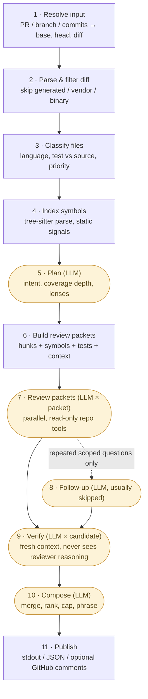

# codegenie 🧞

**AI code review harness.** codegenie is a TypeScript CLI that reviews PR-style diffs at a staff-engineer level — real bugs, logic errors, security issues, architectural risks, and missing tests — and avoids wasting your attention on nitpicks. It prefers no comments over weak comments. codegenie supports all popular LLM providers.

It is not a chatbot pointed at a diff. It is a multi-staged code review harness: a staged pipeline where deterministic code owns the guarantees (coverage, anchoring, verification, dedup, budgets, telemetry) and LLM agents do the judgment work inside each stage. codegenie is built on pi AI library and tree-sitter language parser to offer the harness more powerful tools to traverse code more efficiently.

## Install

```bash
npm install -g @0xsequence/codegenie   # or: bun install -g @0xsequence/codegenie
```

Or run without installing: `npx @0xsequence/codegenie --help`

> Note: the npm package will move out of the `@0xsequence` scope in the future.

## Quick start

```bash
# 1. Connect a model provider (pick one)
codegenie provider login anthropic --api-key   # Anthropic API key
codegenie provider login openai-codex          # ChatGPT plan (browser OAuth)
codegenie provider login openai --api-key      # OpenAI API key

# 2. Pick your default model (fuzzy-matched)
codegenie provider use opus       # -> anthropic/claude-opus-5
codegenie provider use gpt-5.5    # -> openai-codex/gpt-5.5

# 3. Review your current branch
codegenie review
```

The report prints to stdout as Markdown. A review with findings is a *successful* review: the exit code is `0` either way.

## Reviewing

```bash
codegenie review                            # current branch vs its base (merge-base semantics)
codegenie review --pr 123                   # a GitHub PR — no checkout needed, fork PRs included
codegenie review feat                       # branch vs resolved base
codegenie review --branch feat --base main
codegenie review master...49f4645b          # shorthand for --base master --head 49f4645b
codegenie review abc1234                    # one commit
codegenie review abc1234 def5678            # a commit range
```

A single positional target is branch-first: if it resolves as a branch, codegenie reviews it against its base; otherwise it is treated as a single commit.

First-class syntax context and default language guidance currently cover Go, TypeScript, JavaScript, Rust, Python, and Solidity. JavaScript has its own `lang/javascript` guidance for runtime semantics; `.js`, `.jsx`, `.mjs`, and `.cjs` share the proven ECMAScript adapter implementation without inheriting TypeScript-only checks. JavaScript CommonJS export inference, Flow/JSDoc semantic typing, unsupported proposal syntax, and framework/bundler semantics remain deferred. Solidity packets include contract-owned methods/types/events/errors/state values, source-only imports, overload-safe declaration identity, and deterministic default Foundry test links only when a nearest `foundry.toml` exists. File-level constants are not value symbols. Solidity storage-layout, generated-getter, ABI/export analysis, custom Foundry directories, and Hardhat TypeScript linking remain deferred; Solidity symbols intentionally leave `exported` unset. Python `.pyi` stubs/custom collection and Rust same-file/arbitrary integration-test discovery also remain deferred.

Rust, Python, and Solidity form one language-inventory unit. Their three default-enabled skills intentionally change the global Stage-5 skill inventory, registry hash, and model-call cache identity. That single external measurement boundary occurred when the complete Phase 1-4 inventory reached `origin/next` at `eb20533`; measurements from before and after that revision are not comparable as the same cache/prompt regime. The later Phase-5 gate at `40b87b0` changes validation, packaging policy, fixtures, tests, and documentation but not the bundled-skill inventory or registry hash. A branch push is not an npm/tagged release: `master`, the latest tag, and npm `latest` remain at `v0.4.2` until an explicit release occurs.

The dedicated JavaScript skill and narrowed TypeScript skill create a second intentional Stage-5 inventory/registry/cache boundary at the revision where this complete Phase-6 unit first becomes externally visible. Measurements across that landing are non-comparable prompt/cache regimes. A local implementation or branch push remains distinct from a master merge, tag, npm publication, or GitHub release.

Common options:

```bash
codegenie review --depth light|normal|deep         # review budget & planner bias
codegenie review --lens lang/go --lens core/tests  # restrict lenses for this run
codegenie review --provider anthropic --model claude-opus-5   # one-run model override
codegenie review --reasoning high                  # low | medium | high | xhigh | auto
codegenie review --format json                     # machine-readable review object
codegenie review --pr 123 --post-github-comments   # publish inline comments (explicit flag, never config)
```

Posting to GitHub is a single `COMMENT`-type review with inline comments anchored to changed lines — it never approves or requests changes, and only happens when you pass the flag. Interactive runs show a stderr progress spinner (auto-disabled in CI; `--no-progress` disables it explicitly). Non-posting Markdown/JSON runs emit the full report to stdout; posting runs emit a concise posting summary instead. Action mode separately renders the full report into the status comment, step summary, and report artifact.

## GitHub Action

codegenie ships as a reusable GitHub Action: reviews run automatically on PR open/update, or on demand when a collaborator comments `codegenie review` on a PR. The run posts a single status comment ("Reviewing ...") that live-updates through the pipeline stages and finishes as the full markdown report; inline finding comments post as a PR review alongside it (on by default, `post-inline-comments: "false"` disables).

```yaml
# .github/workflows/codegenie.yml
name: codegenie review
on:
  pull_request:
    types: [opened, synchronize, ready_for_review]
permissions:
  contents: read
  pull-requests: write
  issues: write
concurrency:
  group: codegenie-review-pr-${{ github.event.pull_request.number }}
  cancel-in-progress: true  # newest event wins; a push supersedes the stale review
jobs:
  review:
    runs-on: ubuntu-latest
    timeout-minutes: 45
    steps:
      - uses: actions/checkout@v7
        with:
          ref: ${{ github.event.pull_request.base.sha }}  # trusted base; PR head is fetched as review data
          fetch-depth: 0
      - uses: 0xPolygon/codegenie@v0.5.1
        with:
          model: "anthropic/claude-opus-5:high"
          llm-api-key: ${{ secrets.LLM_API_KEY }}
```

The `model` input is one spec: `provider/model[:reasoning]` — any model in [models.md](./models.md) works (`openai/gpt-5.5:xhigh`, `google/gemini-3-pro`, ...), with reasoning defaulting to `high`. `llm-api-key` is provider-generic: codegenie routes it to whatever variable the named provider reads. Provider-native env vars (`ANTHROPIC_API_KEY`, `OPENAI_API_KEY`, ...) also work and take precedence if you already keep secrets under those names.

See `examples/workflows/` for both trigger lanes (automatic and comment-triggered). All authorization — exact trigger-phrase match, live write-permission check — happens inside codegenie; the workflows contain no gating logic to drift. Cancellation policy is one rule: `cancel-in-progress: true`, newest event wins — a push supersedes the now-stale review. On the comment lane that also means any comment on a PR supersedes that PR's in-flight run before codegenie decides it's a skip; if your PR threads are chatty, set it to `false` there (re-triggers queue instead), or gate a separate ungrouped job with the `preflight-only` input for the strictest setup. Fork `pull_request` events skip cleanly (the comment lane serves fork PRs), and all posting is deterministic harness code — reviewed content and comment text never reach the model as instructions or tools. Costs are the usual two: GitHub Actions minutes and provider tokens.

## Providers and models

```bash
codegenie provider list                  # known providers and auth status
codegenie provider login <provider>      # OAuth by default; --api-key to store a key
codegenie provider models [query]        # list available models (e.g. `models gpt`)
codegenie provider use <model>           # set the default by fuzzy model id
```

The full list of supported models — every provider, model id, context window, and reasoning levels — lives in [models.md](./models.md) (generated from the [models.dev](https://models.dev) registry; regenerate with `make models-list`).

`provider use` fuzzy-matches: `use opus`, `use sonnet`, `use gpt-5.5` all resolve to a concrete provider/model pair and print what they picked. Credentials and defaults live under `~/.codegenie/`, never in the repository. Supported lanes include Anthropic (API key) and OpenAI via both the API and ChatGPT-plan Codex OAuth — all on each provider's current APIs.

## Configuration

Drop a `codegenie.toml` in your repo root. Everything has sensible defaults; a typical config is small:

```toml
[git]
baseBranch = "main"

[review]
depth = "normal"
maxTime = 60        # positive number of minutes; --max-time overrides this per run
budgetBoost = 1.0   # scales per-packet review budgets; does not change finding caps

[telemetry]
enabled = true      # opt into local run artifacts under .codegenie/runs

[[classification.pathRules]]
pattern = "lib/payments/**"
reviewPriority = "critical"
labels = ["payments"]

[[classification.pathRules]]
pattern = "generated/**"
processingMode = "skip"
```

- **Telemetry is off by default.** Repo config may only set `telemetry.enabled`; user-level `~/.codegenie/config.toml` can also set run directory, log level, and retention.
- **Skills travel with the repo.** Teams can version project-specific review expertise as Markdown skills in `.codegenie/skills/` — concrete checks, false-positive rules, and safe patterns.
- **Budgets are dispatch controls, not mid-call interrupts.** `review.maxTime` defaults to 30 minutes and may be set in repo or user config; `--max-time <minutes>` is the final per-run override. Crossing a soft cap lets in-flight work finish, records the overrun, and stops dispatching non-essential work.

## How a review runs

Eleven stages, each with a telemetry and artifact boundary. Five make LLM calls (shaded); everything else is deterministic code — and the deterministic stages own the guarantees.



| # | Stage | What it does | LLM calls |
|---|-------|--------------|-----------|
| 1 | Resolve input | Turn `--pr` / branch / commit args into trusted base+head revisions and the raw diff. | — |
| 2 | Parse & filter | Parse the unified diff; skip generated/vendor/lock/binary files; short-circuit zero-work runs. | — |
| 3 | Classify | Assign language, test-vs-source status, review priority, and path-rule labels. | — |
| 4 | Index | Build the symbol index (tree-sitter), extract changed-symbol facts and static risk signals. | — |
| 5 | Plan | Decide intent framing, per-hunk coverage depth, and lenses. Doesn't hunt bugs. | 1 |
| 6 | Build packets | Assemble focused packets: changed hunks, enclosing symbols, file outline, likely tests, bounded related context. | — |
| 7 | Review | Parallel reviewers examine each packet with read-only repo tools (`read_symbol`, `find_definition`, …) and return candidate findings + uncertainties. | 1 per packet |
| 8 | Follow up | Runs only when several packets independently raise the same scoped question; most runs skip it. | 0–few |
| 9 | Verify | Every candidate is independently re-examined in a fresh context that never saw the reviewer's reasoning. | 1 per candidate |
| 10 | Compose | Dedupe and merge same-root-cause findings, rank, cap, and phrase the final review. | 1 |
| 11 | Publish | Write stdout/JSON; post GitHub comments only with the explicit flag. | — |

The unit of review is the changed hunk; the unit of understanding is the affected system. Reviewers don't get the repository dumped into context — they get a compact packet plus tools to pull exactly what a concern depends on, within per-packet budgets.

## Design and philosophy

**Judgment in the model, invariants in the harness.** codegenie has four primary LLM decision points — planner, reviewer, verifier, composer — and everything else is deterministic plumbing. A fully autonomous agent is one decision point making hundreds of unauditable micro-decisions; we'd rather have a few auditable ones. The value of a review tool isn't "finds bugs" (frontier models do that for free) — it's the guarantees around the findings:

- **Coverage honesty.** Every hunk gets a decision or a disclosed skip reason. An autonomous agent cannot tell you what it *didn't* look at.
- **Independent verification.** Verifiers never see the reviewer's reasoning, so they can't anchor on it — that separation only exists because the workflow enforces it.
- **Diagnosable quality.** Typed artifacts between stages mean every miss is attributable: missed at generation, killed at verification, deduped, or cut by the cap. An end-to-end agent tells you *that* it missed; a staged harness tells you *why*.
- **Precision economics.** One wrong comment posted publicly burns trust fast. Autonomy optimizes exploration; a review product needs precision enforced in code.

Autonomy still lives where it earns its keep — *inside* the stages, where reviewers and verifiers investigate with tools, within budgets. **Policy by model, invariants by code.**

**Deterministic first.** Everything that can be deterministic is: diff parsing, classification, symbol extraction, packet construction, anchoring, fingerprinting, caps. Tree-sitter is the cross-language syntax substrate, treated as *syntactic evidence, not semantic truth* — tool results carry backend and precision provenance so a reviewer knows how much to trust what it read.

**Focused context beats big context.** A model handed a 100k-token diff reviews everything a little and nothing well. Small dense packets plus targeted tools invert that.

**Skills are checks, not personas.** A skill is a Markdown file of concrete checks, false-positive rules, safe patterns, and examples — not "you are a meticulous senior engineer" theater. Guidance is projected per stage so it lands where it changes behavior.

**Built to be evaluated.** With telemetry enabled, every run writes typed artifacts — plan, packets, candidates, verdicts, selections, budgets, per-call cost. `codegenie eval` replays real repos against expected findings and scores misses *by loss stage*. The eval suite, the skills, and the telemetry are the compounding assets — models swap underneath them.

**Reviewing untrusted code is a security problem.** A PR is attacker-controlled input flowing into tool-equipped LLMs whose output gets posted publicly. Untrusted content is structurally delimited as data-not-instructions; tools enforce repo-root containment; repo config can never enable command execution or posting; comments pass deterministic sanitization before posting.

**Fail honestly, degrade predictably.** A failed planner falls back to a deterministic plan; a failed packet marks its hunks in coverage; budget exhaustion stops future dispatch without discarding completed work. Partial reviews exit `0` and *say they're partial*.

**Build when evidence demands it.** Richer designs (hierarchical planning, per-role model tiering, cross-packet indexes) are specified but deferred behind written triggers — machinery is added when telemetry shows it improves review quality, never speculatively.

## Development

Run `pnpm run check` for TypeScript and GitHub workflow validation, then `pnpm test` and `pnpm build` for the full suite. Workflow validation uses [`actionlint`](https://github.com/rhysd/actionlint); `pnpm test` runs it automatically so GitHub expression/context errors cannot pass while unit tests remain green.

## Status

codegenie is a pre-1.0 CLI being hardened through live evals. Full specifications live in [`specs/project/`](specs/project/):

- [`project_overview.md`](specs/project/project_overview.md) — goals and shape
- [`functional_spec.md`](specs/project/functional_spec.md) — behavior, stages, contracts
- [`architecture.md`](specs/project/architecture.md) — components, data model, technology choices

Built with TypeScript, [`@earendil-works/pi-ai`](https://www.npmjs.com/package/@earendil-works/pi-ai), web-tree-sitter, and `git`/`gh` as the only external CLI dependencies.
